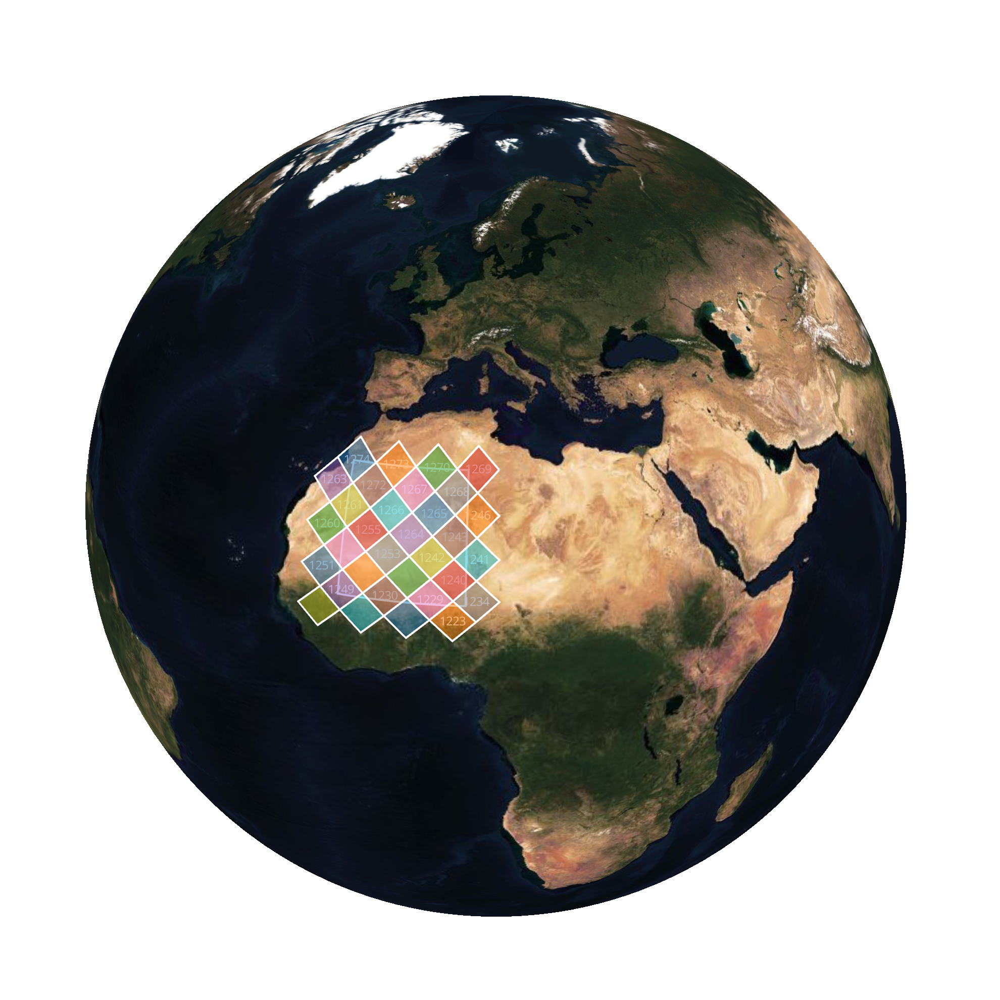
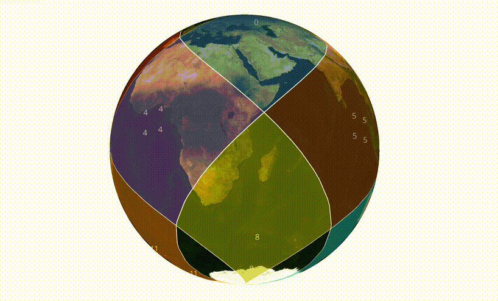

<p align='center'>
  <a href='https://github.com/developmentseed/healpix-ts'>HEALPix Typescript</a> | <a href='https://github.com/developmentseed/deck.gl-healpix'>HEALPix Deck.gl</a> 
</p>


# HEALPix TypeScript

TypeScript implementation of the **HEALPix** (Hierarchical Equal Area isoLatitude Pixelization) spherical projection system, with functions to convert HEALPix to longitude/latitude, and vice versa.

Based on [Górski et al. (2005)](http://iopscience.iop.org/article/10.1086/427976/pdf). A more in depth explanation of the concepts can be found in the [CONCEPTS](docs/CONCEPTS.md) document.

> [!IMPORTANT]  
> **Attribution**: This implementation is highly based on [michitaro/healpix](https://github.com/michitaro/healpix). Code was forked, organized, documented, and new features added.

## What is HEALPix?

HEALPix is a scheme for dividing a sphere into pixels with three key properties:

1. **Equal Area**: Every pixel has exactly the same area (important for statistical analysis)
2. **Hierarchical**: Pixels can be subdivided into 4 children (enables multi-resolution)
3. **Iso-Latitude**: Pixel centers lie on rings of constant latitude (enables fast spherical harmonics)

HEALPix is widely used in astronomy (CMB analysis, sky surveys) and geospatial applications.

## Installation

```bash
npm install healpix-ts
```

## Quick Start

```typescript
import { 
  order2nside,
  ang2PixNest, 
  pix2AngNest,
  pix2LonLatNest,
  cornersNestLonLat
} from 'healpix-ts'

// Resolution: order 8 = nside 256 = 786,432 pixels
const nside = order2nside(8)

// Convert position to pixel index
const theta = Math.PI / 4  // 45° from north pole
const phi = Math.PI / 2    // 90° longitude
const ipix = ang2PixNest(nside, theta, phi)

// Get pixel center in lat/lon
const [lon, lat] = pix2LonLatNest(nside, ipix)
console.log(`Pixel ${ipix}: lat=${lat.toFixed(2)}°, lon=${lon.toFixed(2)}°`)

// Get pixel corners
const corners = cornersNestLonLat(nside, ipix)
console.log('Corners:', corners)
```

See [API](docs/API.md) for more details.

| | |
|--|--|
|  |  |
| Example of a bounding box query | Grid at different nside values |

## Resolution Levels

| Order | Nside | Total Pixels | Pixel Size (deg²) | Approx. Resolution |
|-------|-------|--------------|-------------------|-------------------|
| 0     | 1     | 12           | 3437.75           | 58.6°            |
| 1     | 2     | 48           | 859.44            | 29.3°            |
| 2     | 4     | 192          | 214.86            | 14.7°            |
| 3     | 8     | 768          | 53.72             | 7.3°             |
| 4     | 16    | 3,072        | 13.43             | 3.7°             |
| 8     | 256   | 786,432      | 0.052             | 13.7'            |
| 10    | 1024  | 12,582,912   | 0.003             | 3.4'             |

## Numbering Schemes

### NESTED Scheme
- Preserves spatial locality (nearby pixels have nearby indices)
- Efficient for hierarchical operations
- Parent pixel: `ipix >> 2`
- Children pixels: `[4*ipix, 4*ipix+1, 4*ipix+2, 4*ipix+3]`

### RING Scheme
- Pixels numbered along iso-latitude rings
- Optimal for spherical harmonic transforms

### UNIQ Scheme
- Packs (order, ipix) into a single integer
- Used for multi-resolution coverage maps (MOC)


## Coordinate Systems

```
3D Vector (X,Y,Z)  ↔  Spherical (z,a)  ↔  Projection (t,u)  ↔  Pixel (f,x,y)  ↔  Index
```

- **3D Cartesian (X, Y, Z)**: Unit sphere, Z = north pole
- **Spherical (z, a)**: z = cos(colatitude), a = azimuth
- **Angular (theta, phi)**: theta = colatitude, phi = longitude
- **Lat/Lon (lat, lon)**: Geographic coordinates in degrees
- **Projection (t, u)**: HEALPix 2D projection
- **Pixel (f, x, y)**: Base pixel + local coordinates
- **Index**: NESTED, RING, or UNIQ

## File Structure

```
src/
├── index.ts           # Main entry point
├── types.ts           # Type definitions
├── constants.ts       # Mathematical constants
├── utils.ts           # Utility functions
├── resolution.ts      # Resolution conversions
├── coordinates/       # Coordinate transformations
│   ├── spherical.ts   # 3D ↔ spherical
│   └── projection.ts  # HEALPix projection
├── pixel/             # Pixel operations
│   ├── fxy.ts         # (f,x,y) coordinates
│   ├── geometry.ts    # Corners, sub-pixel positions
│   └── hierarchy.ts   # Parent/child relationships
├── schemes/           # Numbering schemes
│   ├── nested.ts      # NESTED scheme
│   ├── ring.ts        # RING scheme
│   ├── uniq.ts        # UNIQ scheme
│   └── conversion.ts  # Scheme conversions
├── lookup/            # High-level lookup functions
│   └── lookup.ts      # pix2ang, ang2pix, etc.
├── query/             # Spatial queries
│   ├── disc.ts        # Disc queries
│   └── box.ts         # Bounding box queries
└── geo/               # Geographic utilities
    └── latlon.ts      # Lat/lon conversions
```

## References

- [HEALPix Official Website](https://healpix.sourceforge.io/)
- [HEALPix Paper (Górski et al. 2005)](http://iopscience.iop.org/article/10.1086/427976/pdf)
- [HEALPix Documentation](https://healpix.sourceforge.io/html/intro.htm)
- [michitaro/healpix](https://github.com/michitaro/healpix) – Original JavaScript/TypeScript implementation

## License

MIT – see [LICENSE](LICENSE)
